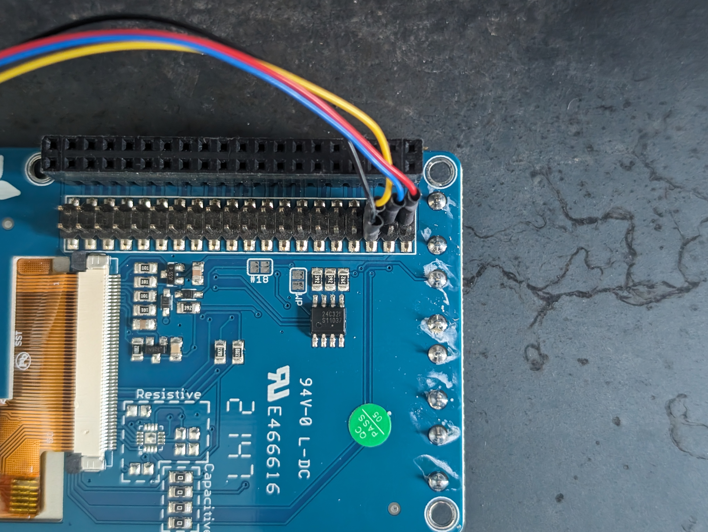

## Raspberry Pi Environmental Monitor

### Parts List
- [Raspberry Pi](https://www.adafruit.com/product/4292)
- [Power Supply](https://www.adafruit.com/product/4298)
- [SD Card](https://www.adafruit.com/product/2693)
- [AQI Sensor](https://www.adafruit.com/product/4632)
- [CO2 + Humidity Sensor](https://www.adafruit.com/product/5190)
- [Temp + Pressure Sensor](https://www.adafruit.com/product/2651)
- [qwicc I2C cables (4)](https://www.adafruit.com/product/4210)
- [Raspi Display](https://www.adafruit.com/product/2423)

### Tools Needed
---
- Computer capable of writing image to SD card
- Soldering Iron

These tools are optional, but recommended unless you're experienced with setting up "headless" raspberry pis over SSH or VNC

- Mini-HDMI to HDMI
- HDMI Monitor
- Keyboard + Mouse

### Assembly Instructions
- Solder or connect qwicc cable to these pins on the screen, or on raspi if not using screen
</img>
### Installation
- get Raspberry Pi OS running on Pi
	- see: [Installation](https://www.raspberrypi.com/software/)
#### Initial Configuration
Text that appears like `this` is entered into the command line (terminal) one command at a time. text in `<brackets>` is replaced (including the brackets) with the relevant folder or path for your case.

For example, `<project_directory>` for you might be replaced with `/home/alice/envmon`, if your username were alice.

The following commands are to be run one at a time.
- `sudo apt update && sudo apt upgrade`
- `sudo apt-get install i2c-tools git python3-pip`
- `sudo raspi-config`
	- enable i2c
	- enable spi
	- enable SSH
	- expand filesystem
	- reboot
- Log back in

#### Display Setup
You can skip this step if you aren't using the display we used, or replace these instructions with the relevant ones from the seller/manufacturer of your display.
- `cd ~`
- `pip3 install --upgrade adafruit-python-shell click`
- `git clone https://github.com/adafruit/Raspberry-Pi-Installer-Scripts.git`
- `cd Raspberry-Pi-Installer-Scripts`
- `python3 -m pip install -r requirements.txt --break-system-packages`
- `sudo -E env PATH=$PATH python3 adafruit-pitft.py --display=28c --rotation=90 --install-type=mirror`
- Shutdown and connect screen
- Power on
- If screen works, continue
see: [Install Instructions](https://learn.adafruit.com/adafruit-2-8-pitft-capacitive-touch/easy-install-2) for more detail

#### Installing Envmon
Change directory to home, and clone the project using git.
- `cd ~`
- `git clone <link_to_project>` _REPLACE ME WITH ACTUAL PROJECT LINK!!!_
- `cd ./<project_dir>`

We make a python virtual environment so that we don't accidentally mess up other system-wide python dependencies.
- `python3 -m venv .venv`
- `source .venv/bin/activate`
- `pip3 install -r requirements.txt`

Note that "sourcing" this venv does not persist across rebooting or exiting the shell. `pip -V` will show the current python environment path, to see if you are in a venv or not.

#### Setting up EnvMon
- Plug in sensors one at a time
- `sudo i2cdetect -y 1`
- Plug in sensors and repeat previous step until all sensors are detected.
- if all sensors work, run main script
- `python3 main.py`
- exit script with keyboard interrupt (control + c)

#### Further Reading:
- [Logging sensor data](https://tutorials-raspberrypi.com/log-raspberry-pi-sensor-data-with-thingspeak-and-analyze-it/)
